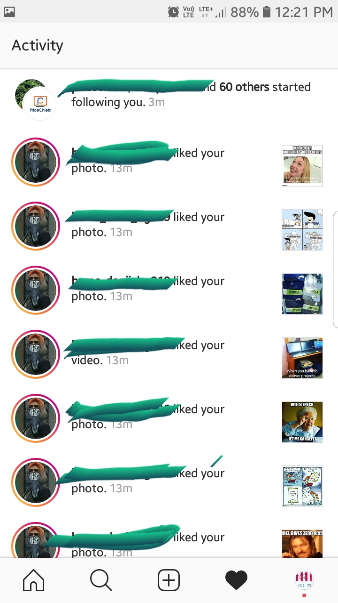
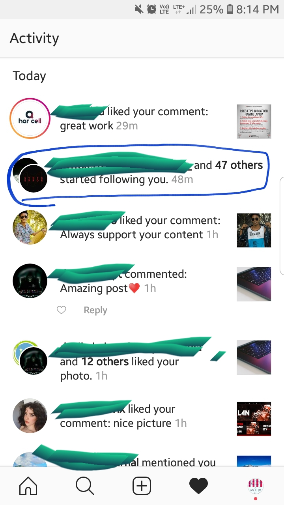

# Instagram-bot-100X-followers
Instagram bot that manages your instagram profile. I went from 30 to 250 followers in 2 days..!

## How does it work..!
    You need to provide your credentials into insta.py file and type hastags to follow.
    Paste images you want to post on instagram into posts folder. Everytime this app logins it will post a image from folder.

    it uses chrome browser and  automated software selenium.
    It logins automatically into instagram and posts a picture from posts folder.
    It take hastags and visits hastags and navigates to posts 
    It Likes images, Post comments and follows.
    
    Your account will not be blocked because bot uses browser to do all these. 
    You can minimise browser if you want to minimise. 

## things you should check.
    chromedriver.exe file should be there in directory
    credentials should be filled and 2 factor authentication should be disabled.
    posts folder should have images to post. 
    consumes 200MB per whole day 

